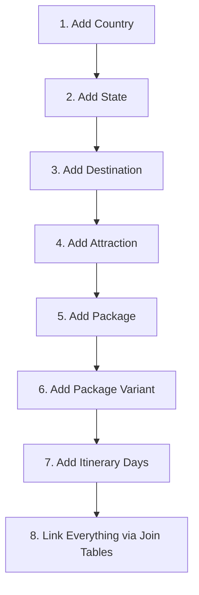

# Mother India Tour Travels — Comprehensive Admin & Data Management Manual

Welcome to the data management manual for the Mother India Tour Travels administration system. This document provides clear, step-by-step instructions for adding, editing, and linking database records.

---

## 1. Accessing the Admin Panel

1. **Dashboard URL**: Go to `/manage/` on your browser (or `/manage/login/` if not logged in).
2. **Authentication**: Enter your admin email and password.
3. **Sidebar**: Use the left sidebar to navigate between groups:
   - **Core Geography**: Countries, States, Destinations, Attractions.
   - **Tour Packages**: Packages, Package Variants, Itinerary Days, Categories, and relation link tables.
   - **CMS & Content**: Blog Posts, Hero Configurations, Testimonials, FAQs, Company Details.
   - **Leads & System**: Bookings, Contacts, Newsletter Subscribers.

---

## 2. Step-by-Step Guide: Adding a Tour Package (Start to Finish)

You cannot add a package all at once. Because the database relies on structured relationships, you must follow this exact sequence.

### Step 1: Add a Country

1. Go to **Core Geography** > **Countries**.
2. Click **Create Record** in the top right.
3. Fill in the fields:
   - **Name**: e.g., `India`
   - **Slug**: e.g., `india` (lowercase, no spaces, used in URLs).
   - **Continent**: e.g., `Asia`
   - **Is Domestic**: Toggle on if it's within India.
   - **Is Featured**: Toggle on to highlight it on the homepage.
   - **Capital**: e.g., `New Delhi`
   - **Currency Code**: e.g., `INR`
   - **Languages**: Press Enter after typing each language to add multiple.
   - **Visa Required / Visa On Arrival**: Check as applicable.
   - **Flag / Cover Image**: Drag & drop or upload a flag or cover banner.
   - **Latitude & Longitude**: (See Section 3 for finding coordinates).
4. Click **Save Record**.

### Step 2: Add a State (For Domestic Tours)

1. Go to **Core Geography** > **States**.
2. Click **Create Record**.
3. Fill in the fields:
   - **Name**: e.g., `Kashmir`
   - **Slug**: e.g., `kashmir`
   - **Country**: Select `India` from the dropdown list.
   - **Capital**: e.g., `Srinagar`
   - **Is Featured**: Check if you want to feature this state.
   - **Cover Image**: Upload a high-quality cover photo.
   - **Description**: Provide state details.
4. Click **Save Record**.

### Step 3: Add a Destination

A Destination is a specific town or region where travelers stay (e.g., Srinagar, Gulmarg, Jaipur).

1. Go to **Core Geography** > **Destinations**.
2. Click **Create Record**.
3. Fill in the fields:
   - **Name**: e.g., `Gulmarg`
   - **Slug**: e.g., `gulmarg`
   - **Destination Type**: Select `City`, `Hill Station`, `Beach`, `Wildlife`, `Pilgrimage`, `Heritage`, etc.
   - **Country & State**: Select from the dropdowns.
   - **Best Time to Visit**: e.g., `October to March`
   - **Climate Info**: e.g., `Snowy winters, pleasant summers`
   - **Cover Image**: Upload a scenic landscape photo.
   - **Description**: Detail what makes this place special.
   - **Latitude & Longitude**: Insert coordinates.
4. Click **Save Record**.

### Step 4: Add Attractions (Sightseeing Landmarks)

1. Go to **Core Geography** > **Attractions**.
2. Click **Create Record**.
3. Fill in the fields:
   - **Name**: e.g., `Gulmarg Gondola`
   - **Slug**: e.g., `gulmarg-gondola`
   - **Destination**: Select `Gulmarg` from the dropdown.
   - **Image**: Upload an attraction photo.
   - **Description**: Add historic or tourist activity notes.
   - **Sort Order**: Set `0` (or `1`, `2` to sequence sights).
   - **Latitude & Longitude**: Insert coordinates of the landmark.
4. Click **Save Record**.

### Step 5: Add the Base Package

1. Go to **Tour Packages** > **Packages**.
2. Click **Create Record**.
3. Fill in the fields:
   - **Package Name**: e.g., `Magical Kashmir Tour`
   - **Slug**: e.g., `magical-kashmir-tour`
   - **Overview Detail**: A rich text overview introducing the package.
   - **Highlights**: Add key summary points (e.g., _Houseboat Stay_, _Gondola Ride_). Type a point, then press Enter to lock it.
   - **Inclusions**: Bullet points of what is covered (e.g., _Double room Stays_, _Breakfast & Dinner_, _Airport pickup_).
   - **Exclusions**: Bullet points of what is NOT covered (e.g., _Flight tickets_, _Lunch_, _Attraction entry tickets_).
   - **Important Notes**: Add terms, packing guidelines, or advisory notes.
   - **Hero Banner Image**: Upload the main landing photo.
   - **Gallery Images**: Add secondary photos showing sightseeing highlights.
   - **Tour Style**: e.g., `Classic`, `Honeymoon`, `Adventure`.
   - **Accommodation Style**: e.g., `4-Star Hotels & Luxury Houseboat`.
   - **Is Popular / Is Domestic**: Set checks.
   - **Country & State**: Select matching locations.
4. Click **Save Record**.

### Step 6: Add Package Variants

A variant determines the actual duration and pricing of the package.

1. Go to **Tour Packages** > **Package Variants**.
2. Click **Create Record**.
3. Fill in the fields:
   - **Parent Package**: Select `Magical Kashmir Tour` from the list.
   - **Slug Variant**: e.g., `5n-6d`
   - **Display Label**: e.g., `5 Nights / 6 Days Premium`
   - **Nights / Days**: e.g., `5` nights, `6` days.
   - **Base Price / Discounted Price**: Set numerical values (e.g., Base: `24999`, Discounted: `19999`). Do not include currency symbols.
   - **Is Default**: Toggle on if this variant is the main one displayed on package listings.
4. Click **Save Record**.

### Step 7: Create Itinerary Days

You must create a record for each day of the variant's duration.

1. Go to **Tour Packages** > **Itinerary Days**.
2. Click **Create Record**.
3. Fill in:
   - **Package Variant**: Select the parent variant (e.g., `Magical Kashmir Tour - 5 Nights / 6 Days Premium`).
   - **Day Number**: e.g., `1` (Must be a number).
   - **Day Title**: e.g., `Arrival in Srinagar & Shikara Ride`
   - **Day Activities**: Input a detailed narrative of the day's route, meals, and hotels.
   - **Sightseeing Images**: Upload photos highlighting the day's sights.
4. Click **Save Record**.
5. Repeat this process for Day 2, Day 3, and so on, until all days are populated.

### Step 8: Link Associations (The Join Tables)

Finally, bind the tables together using these three join-table sections:

1. **Package Destinations** (Crucial for generating the interactive map):
   - Go to **Package Destinations** > **Create Record**.
   - Select the **Package Variant** (e.g., `Magical Kashmir Tour - 5n-6d`).
   - Select the **Destination** (e.g., `Srinagar`).
   - **Sort Order**: Set `1` (meaning Srinagar is the 1st stop).
   - Click **Save**.
   - Create another record for Gulmarg, set **Sort Order** to `2`.
   - Repeat for all destinations in the route.

2. **Package Categories** (For filtering):
   - Go to **Package Categories** > **Create Record**.
   - Select the **Package** (e.g., `Magical Kashmir Tour`).
   - Select the **Category** (e.g., `Honeymoon`).
   - Click **Save**.

3. **Package Attractions** (To list sights in the sidebar):
   - Go to **Package Attractions** > **Create Record**.
   - Select the **Package Variant** (e.g., `Magical Kashmir Tour - 5n-6d`).
   - Select the **Attraction** (e.g., `Gulmarg Gondola`).
   - Click **Save**.

---

## 3. Deployment — When to Trigger a Website Build

The website is **static** — meaning all pages are pre-built into HTML files. Changes you make in the admin panel (adding a blog, updating a package, etc.) only exist in **the database**. They won't appear on the live website until the project is rebuild and redeployed.

### When to Deploy

You must deploy after any change that affects the public-facing content:

| Change                                                    | Deploy Required? | Reason                                        |
| --------------------------------------------------------- | :--------------: | --------------------------------------------- |
| Add / update a **Tour Package**                           |        ✅        | Packages are pre-built into static pages      |
| Delete / disable a **Tour Package**                       |        ✅        | The old page must be removed from the build   |
| Add / update / delete a **Blog Post**                     |        ✅        | Blog pages are generated at build time        |
| Add / update / delete **Destinations**                    |        ✅        | Impacts homepage and package content          |
| Add / update / delete **Hero Slides**                     |        ✅        | Hero banner is compiled into the homepage     |
| Update **Company Details** (schedule, social links, etc.) |        ✅        | Footer and contact info are static            |
| Update **Testimonials, FAQs, Site Sections**              |        ✅        | Landing page sections are baked at build time |
| Add / update / delete **Gallery Images**                  |        ✅        | Gallery is rendered from static data          |
| Add / update / delete **Categories**                      |        ✅        | Used for package filtering                    |
| Change **Hero Config** mode (SLIDES → VIDEO)              |        ✅        | Config is read at build time                  |
| Update **Countries / States / Attractions**               |        ✅        | Geography data is compiled into pages         |
| Change **admin user roles or access**                     |        ❌        | Admin panel is API-driven (live)              |
| Update **Bookings / Contacts / Subscribers**              |        ❌        | These are live API records, not static pages  |

### When NOT to Deploy

Do **not** deploy after every single admin change. Instead:

1. **Batch your changes** — Add the country, state, destination, attractions, package, variants, itinerary days, and join-table links all at once.
2. **Deploy once at the end** — After you've completed all related changes, trigger a single deployment.
3. **Plan your content updates** — Collect a list of pending changes (new blogs, updated packages, fixed typos) and deploy them together in one batch.

This saves build time and avoids unnecessary FTP uploads.

### How to Deploy

The admin panel has a built-in deploy button:

1. **Click "Deploy Website"** — Look for the button in the top-right area of the admin panel header (available on most admin pages).
2. **Confirm** — A dialog will ask you to confirm. Click **Deploy Now**.
3. **Watch the status** — The button will show the current deployment state (Triggering... → Triggered!). A link to the live GitHub Actions run appears beside the button — click it to track the build in real time.

Behind the scenes, the button sends a `POST /deploy` request to the API worker, which triggers the GitHub Actions workflow (`.github/workflows/deploy-cpanel.yml`). The workflow will:

1. Build the static export (`npm run build`).
2. Upload only the changed files to the cPanel server via FTP.

> **Tip**: For small teams, keep a list of "pending publish items" in your task tracker and deploy once a day or once a week, rather than after every single record save.

---

## 4. How to Find Latitude & Longitude Coordinates

Accurate coordinates are necessary for displaying map markers on the frontend.

1. Open **[Google Maps](https://maps.google.com)**.
2. Search for the city or landmark (e.g., _Taj Mahal, Agra_).
3. Zoom in to locate the exact point.
4. **Right-Click** directly on the map location.
5. A context menu will appear. The first item at the top displays the coordinates (e.g., `27.17514, 78.04214`).
6. **Left-Click** on those numbers to copy them.
7. Paste them into the admin form:
   - **Latitude**: `27.17514`
   - **Longitude**: `78.04214`

---

## 5. Homepage Hero Config (Slides & Videos)

You can toggle the home landing banner between a looping video background and an image slide carousel.

### Configuring the Mode

1. Go to **CMS & Content** > **Hero Configs**.
2. Click the edit button for the singleton record (ID = 1).
3. Set **Hero Mode**:
   - `VIDEO`: Plays a background video. Paste the video file URL in **Video Url**.
   - `SLIDES`: Loops through background images.
4. Click **Save**.

### Managing Slides

If mode is set to `SLIDES`:

1. Go to **CMS & Content** > **Hero Slides**.
2. Click **Create Record**.
3. Fill in:
   - **Slide Image**: Upload a high-quality landscape image (1920x1080 recommended).
   - **Tag**: e.g., `Best Seller` (Shows as a small orange badge).
   - **Title**: e.g., `Discover Srinagar` (Main heading).
   - **Description**: Subtext caption.
   - **Sort Order**: Numeric order.
4. Click **Save**.

---

## 6. Company Details (Branding & CMS)

Go to **CMS & Content** > **Company** and edit the singleton record (ID = 1) to update global brand details.

### Business Schedule (Visual Editor)

- Instead of raw text, check the boxes for operating days (e.g., Monday through Friday).
- Set the **Open** and **Close** times for each day block. Click **Add Slot** to configure split shifts if necessary.

### Holiday Exceptions (Visual Calendar Editor)

- Click **Add Holiday Exception**.
- Pick the **Date** using the calendar input.
- Type the **Reason** (e.g., _Diwali Holiday_).
- Check **Closed All Day** to mark the office as unavailable.

### Social Media Profiles

- Enter the profile URLs in the corresponding fields for Facebook, Instagram, Twitter/X, LinkedIn, Pinterest, YouTube, and WhatsApp.

### About Us Narrative (Multi-Tab Form)

- **Header & Stats**: Edit badge labels, main title, cover image, and statistics grid (e.g., Value: `20+`, Label: `Years Experience`).
- **Our Mission, Vision, and Strength & Team**: Write descriptions, add bullet list points (press Enter after each to add), and upload accent images.
- **How We Work**: Set the section title, description, and link a YouTube video.
- **Footer Narrative**: Provide the summary text shown in the website footer.
