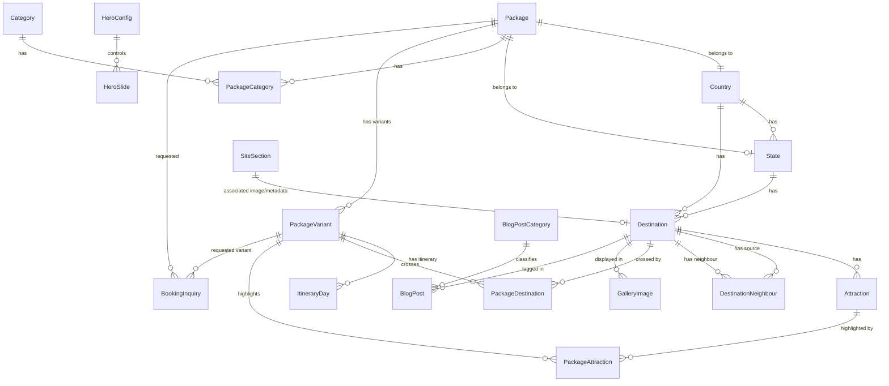

# Mother India Tour Travels Database Schema

This document describes the relational database schema design for the Mother India Tour Travels platform. The exact schema is defined programmatically in [schema.prisma](./schema.prisma) and deployed on a PostgreSQL instance hosted by Supabase.

## Architecture Overview

The database is divided into four main logical groups. This structure accommodates custom pricing, routes, galleries, and itineraries for different durations of the same package (e.g., a "3 Nights / 4 Days" variant vs. a "5 Nights / 6 Days" variant of a Kashmir Tour).

---

## 1. Geography Module

Organizes physical locations hierarchically to support search, filtering, and mapping.

- **Country**: Represents physical target countries (e.g., India, Nepal, Bhutan). Contains basic visa, currency, metadata, and relations to states, destinations, and packages.
- **State**: Represents administrative regions under a country (e.g., Kerala, Rajasthan, Ladakh). Matches packages to specific states for regional listings.
- **Destination**: Represents cities or key tourist areas (e.g., Munnar, Agra, Srinagar). Serves as a hub for local attractions, blog posts, and gallery images.
- **DestinationNeighbour**: Self-join join table marking nearby destinations for contextual maps and recommendations.
- **Attraction**: Specific sightseeing points of interest (e.g., Taj Mahal, Dal Lake) with geo-coordinates, sorted by relevance.

---

## 2. Packages & Tours Module

Represents the tours catalog, pricing, durations, maps, and day-by-day itineraries.

- **Category**: Grouping entities (e.g., "Honeymoon", "Adventure", "Family").
- **Package**: The master package shell. Houses high-level parameters like general stays, average group sizes, marketing pitches, inclusions, exclusions, and guidelines.
- **PackageVariant**: Different duration/nights configurations for a package (e.g., "3n-4d", "5n-6d"). Contains pricing levels, custom hero/gallery overrides, and maps the route.
- **ItineraryDay**: The daily schedule details linked to a specific package variant. Supports custom descriptions and daily images.
- **PackageCategory** / **PackageDestination** / **PackageAttraction**: Relational join tables linking packages and variants to their categories, route destinations (with explicit sorting sequence), and attraction pins on the interactive map.

---

## 3. CMS Content Module

Manages dynamic landing page components, media, FAQs, and blogs.

- **HeroConfig & HeroSlide**: Singleton setting that toggles the homepage banner between an interactive image slider and a full-width background video stream.
- **SiteSection**: Central CMS table housing descriptions, taglines, and backgrounds for specific landing page blocks (e.g., FAQ headers, Gallery headers).
- **FAQ**: Accordion question-and-answer pairs sorted by priority.
- **GalleryImage**: Media assets mapped to specific locations and destinations.
- **BlogPost & BlogPostCategory**: Simple blogging tables supporting Markdown articles, reading times, featured status, and tagging.

---

## 4. Lead Capture & Company Module

Captures analytics, customer inquiries, reviews, and office contact information.

- **BookingInquiry**: Tracks tour booking requests. Supports flexible/fixed travel date selectors, group sizes, hotel class choices, and custom routing instructions.
- **ContactSubmission**: Stores messages sent via the contact form.
- **NewsletterSubscriber**: Tracks mailing list signups.
- **Company**: Singleton record mapping corporate contact profiles, WhatsApp contact links, social profiles, and operational hours.
- **Testimonial**: Customer feedback entries sourced externally (e.g., Google Reviews) and filtered by approval flags.

---

## 5. System & Monitoring Module

Monitors infrastructure health and keeps the Supabase instance active.

- **SystemStatus**: Historical log records storing operational health metrics for the website, API worker, images worker, and database. It tracks latency, individual uptime checks, and records each keep-alive sync execution timestamp for diagnostic dashboards.
