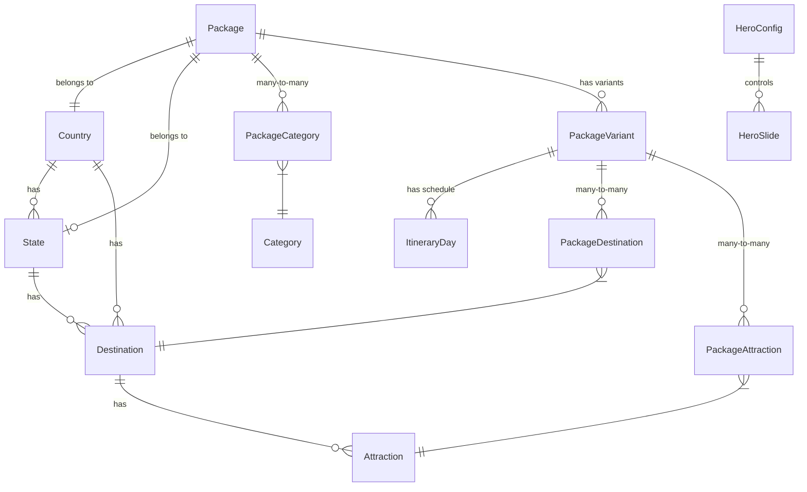

# Mother India Tour Travels Database Schema (v3.0)

This document describes the modern relational database schema v3.0 for the Mother India Tour Travels platform. The schema is defined in [schema.prisma](file://./schema.prisma) and deployed on a PostgreSQL instance hosted by Supabase.

## Overview & Design Decisions

The v3.0 schema shifts destinations, attractions, hero images, and gallery images to the variant-level. This structure allows different durations or options of the same package (e.g. 3 Days vs 7 Days) to cover completely different routes, sightseeing, and custom galleries, while still sharing general package info.

---

## 1. Geography Group

Represents countries, states, destinations, and attractions with coordinates.

### `Country`

Represents target travel countries (e.g. India, Nepal, UAE).

- **Primary Key**: `id` (String CUID)
- **Keys**: `slug` (Unique)
- **Relationships**: Has many `State`, `Destination`, `Package`

### `State`

Represents states/territories under a country (e.g. Delhi, Rajasthan, Kerala).

- **Primary Key**: `id` (String CUID)
- **Keys**: `slug` (Unique)
- **Foreign Keys**: `countryId` -> `Country(id)`
- **Relationships**: Has many `Destination`, `Package`

### `Destination`

Represents cities or key tourist areas (e.g. Agra, Munnar, Dubai).

- **Primary Key**: `id` (String CUID)
- **Keys**: `slug` (Unique)
- **Foreign Keys**: `countryId` -> `Country(id)`, `stateId` -> `State(id)` (Nullable)
- **Relationships**: Has many `Attraction`, `GalleryImage`, `BlogPost`

### `Attraction`

Specific points of interest with exact coordinates (e.g. Taj Mahal, Red Fort).

- **Primary Key**: `id` (String CUID)
- **Keys**: `slug` (Unique)
- **Foreign Keys**: `destinationId` -> `Destination(id)`
- **Fields**: `latitude` (Float), `longitude` (Float), `sortOrder` (Int)

---

## 2. Package Group

Represents tours, duration variants, itinerary days, and variant-level maps/images.

### `Package`

The parent tour itinerary metadata.

- **Primary Key**: `id` (String CUID)
- **Keys**: `slug` (Unique)
- **Foreign Keys**: `countryId` -> `Country(id)`, `stateId` -> `State(id)` (Nullable)
- **Relational Joins**:
  - `categories`: Join table `PackageCategory`
  - `variants`: Has many `PackageVariant`

### `PackageVariant`

Duration/nights variants for a package (e.g. "3n-4d", "5n-6d").

- **Primary Key**: `id` (String CUID)
- **Foreign Keys**: `packageId` -> `Package(id)`
- **Fields**: `slug` (String), `label` (String), `nights` (Int), `days` (Int), `basePrice` (Float, Nullable), `discountedPrice` (Float, Nullable), `heroImage` (String, Nullable), `galleryImages` (String[]), `isDefault` (Boolean)
- **Relational Joins**:
  - `destinations`: Join table `PackageDestination` (with `sortOrder` for routing)
  - `attractions`: Join table `PackageAttraction` (drawn on route maps)

### `ItineraryDay`

Daily schedules linked to a specific package variant.

- **Primary Key**: `id` (String CUID)
- **Foreign Keys**: `variantId` -> `PackageVariant(id)`
- **Fields**: `day` (Int), `title` (String), `description` (String), `images` (String[])

---

## 3. Content CMS Group

### `HeroConfig` & `HeroSlide`

Singleton configuration (id = 1) enabling Hero toggle between slides list and custom video URL.

- **HeroConfig**: `mode` (Enum: SLIDES | VIDEO), `videoUrl` (String)
- **HeroSlide**: Slides mapping with `image`, `tag`, `title`, `description`, `sortOrder`.

### `SiteSection`

Generic section configuration text (e.g. FAQ, Gallery tags) eliminating individual tagline tables.

- **Fields**: `key` (Unique key like "faq"), `tagline` (String), `subtitle` (String)

---

## 4. Lead Capture & Company Group

All lead capture tables (`BookingInquiry`, `ContactSubmission`, `NewsletterSubscriber`) are fully prepared with status columns, but left un-wired on the front-end for later API-based integration.
